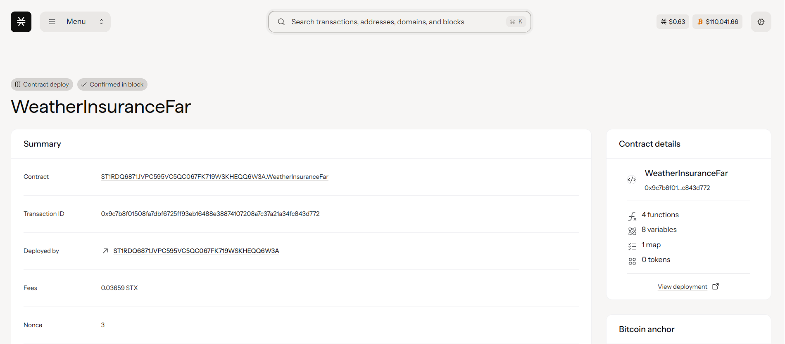

# WeatherInsurance Farm

## Project Description

WeatherInsurance Farm is a revolutionary parametric weather insurance platform built on the Stacks blockchain using Clarity smart contracts. This decentralized solution provides farmers with automated, transparent, and efficient weather-based insurance coverage. The system enables automatic payouts based on predefined weather parameters (specifically rainfall thresholds) without the need for traditional claim processing or manual assessments.

Farmers can purchase insurance policies by paying a premium (10% of coverage amount) and receive automatic compensation when rainfall falls below their specified threshold during the policy period. This eliminates the typical delays and bureaucracy associated with traditional agricultural insurance.

## Project Vision

Our vision is to democratize agricultural risk management by providing farmers worldwide with accessible, transparent, and automated weather insurance. We aim to:

- **Reduce Financial Risk**: Protect farmers from weather-related crop losses through parametric insurance
- **Eliminate Claims Friction**: Provide instant, automatic payouts based on objective weather data
- **Increase Agricultural Resilience**: Enable farmers to invest confidently in their crops knowing they have weather protection
- **Democratize Insurance Access**: Make insurance available to smallholder farmers who traditionally lack access to crop insurance
- **Build Trust Through Transparency**: Use blockchain technology to ensure transparent, immutable insurance contracts

## Future Scope

### Short-term Enhancements (3-6 months)
- Integration with multiple weather data oracles (Chainlink, Weather APIs)
- Support for multiple weather parameters (temperature, humidity, wind speed)
- Mobile app for easy policy management and claims tracking
- Multi-crop insurance options with different risk profiles

### Medium-term Development (6-12 months)
- AI-powered risk assessment and dynamic premium calculation
- Satellite data integration for crop monitoring and yield prediction
- Reinsurance pool mechanism for risk distribution
- Support for multiple cryptocurrencies and stablecoins
- Multi-language support for global adoption

### Long-term Vision (1-3 years)
- Cross-chain compatibility for broader blockchain ecosystem integration
- Integration with agricultural marketplaces and supply chain platforms
- Carbon credit integration for sustainable farming practices
- Expansion to other agricultural risks (pest, disease, market price volatility)
- Development of agricultural cooperatives and mutual insurance pools
- Government partnership programs for subsidized agricultural insurance

### Advanced Features
- Machine learning models for weather prediction and risk modeling
- IoT device integration for real-time farm monitoring
- Decentralized autonomous organization (DAO) governance for community-driven development
- Integration with DeFi protocols for yield farming on insurance premiums
- NFT-based policy certificates for enhanced ownership and transferability

## Contract Address Details

contract ID: ST1RDQ6871JVPC595VC5QC067FK719WSKHEQQ6W3A.WeatherInsuranceFar\

### Contract Functions

#### Public Functions
1. **create-policy**: Create a new weather insurance policy
   - Parameters: coverage-amount, rainfall-threshold, duration-blocks
   - Returns: policy-id

2. **process-weather-claim**: Process automatic weather-based payout
   - Parameters: policy-id, actual-rainfall
   - Returns: payout amount

#### Read-Only Functions
- **get-policy**: Retrieve policy details by ID
- **get-farmer-policies**: Get all policies for a specific farmer
- **get-contract-balance**: Check contract's STX balance

### Getting Started

1. **Connect Wallet**: Connect your Stacks wallet (Hiro Wallet recommended)
2. **Create Policy**: Call `create-policy` with your desired coverage and rainfall threshold
3. **Monitor Weather**: Track weather conditions during your policy period
4. **Automatic Payout**: Receive automatic compensation if rainfall falls below threshold

### Support & Documentation

For technical support, documentation, and community discussions:
- GitHub: [Repository Link]
- Discord: [Community Link]

- Email: support@weatherinsurance.farm
